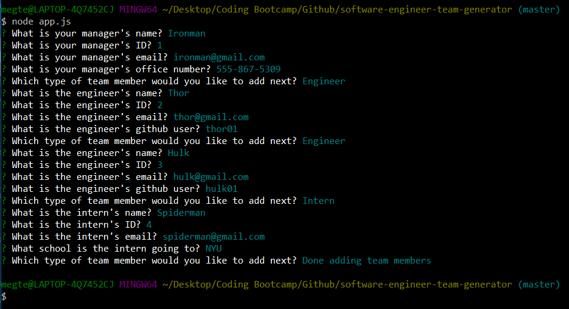
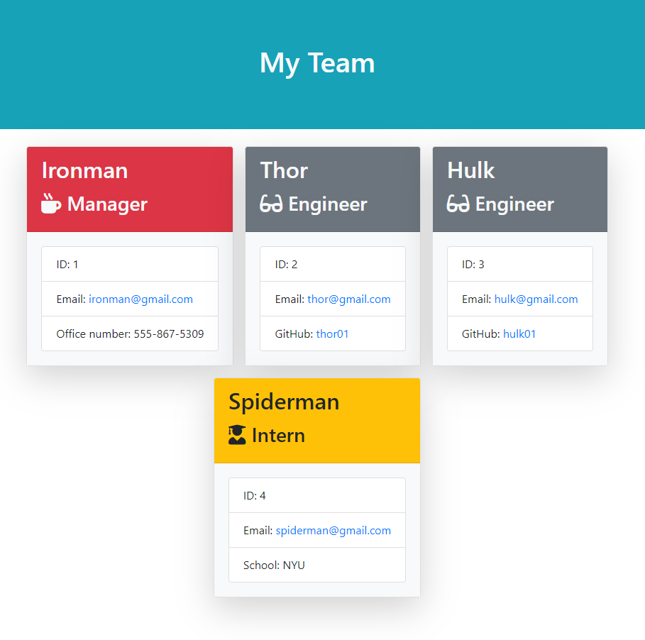

# Software Engineering Team Generator Command Line Application

## Description
This Software Engineering Team Generator CLI application is using the inquirer library and run with node. The user is asked a series of questions to gain information on their team. Once the user is finished answering all the questions, an html page is created to display all members of the team. 

The first set of questions will be for the team manager. The user is asked for the manager name, ID, email, and office number. After the user is finished answering manager questions, the user is given a choice on whether they want to add an intern, engineer, or finished adding team members. 

If the intern role is chosen, the questions asked are intern name, ID, email, and school. If the engineer is chosen, the questions asked are engineer name, ID, email, and github user. The github username is used to display a link to the engineers github profile. 

When all the questions are complete, and the user choses the "Done" option, a "team.html" page is generated in  the output folder. Each team member is displayed as a card on an html page using the bootstrap framework. The members are color-coded as follows: manager is red, engineer is blue, and intern is yellow. 

## Table of contents
* [Installation](#installation)
* [Usage](#usage)
* [License](#license)
* [Contributing](#contributing)
* [Tests](#tests)
* [Video Walkthru](#video-walkthru)
* [screenshots](#screenshots)
* [Questions](#questions)
        
## Installation
To install necessary dependencies, run the following command:
```
npm i
```

## Usage
This is a public repo.

## License 
This project is licensed under the None license.

## Contributing
No contributors at this time.

## Tests
To run tests, run the following command:
```
npm run test
npm run employee-test
npm run engineer-test
npm run intern-test
npm run manager-test
```

## Video Walkthru
<iframe src="https://drive.google.com/file/d/1iRpIc0ELu6Et-Pk3JLIfEcu5uaiaAGx2/preview" width="640" height="480"></iframe>

## Screenshots
CLI:


Webpage:


## Questions
If you have any questions about this repository, open an issue or contact me directly at megtej@gmail.com. You can find more of my work at [mslee001](https://github.com/mslee001).